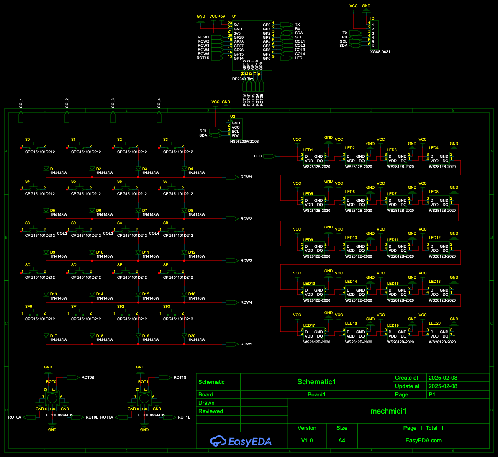

This is a [RP2040-Zero](https://www.aliexpress.us/item/3256807464011140.html) mechanical keyboard I designed to be a MIDI controller/sequencer and/or macro-keypad. It's made to be highly configurable & easy to modify.

I am using some ideas from [here](https://www.youtube.com/watch?v=8WXpGTIbxlQ), and it needs testing (still in progress.)

## Features

- 20-key keypad with Cherry MX switches
- OLED 128x64 display
- 2 rotary encoders (each with a button)
- 20 RGB LEDs
- i2c port for adding more stuff onto it (for example I might make a dongle for bluetooth or USB midi/keyboard/mouse/gamepad host)
- old-school MIDI in/out
- Fully programmable with [CircuitPython](https://circuitpython.org/)
- Use [KMK](https://github.com/KMKfw/kmk_firmware) for a more keyboard-focused firmware (programmable keyboard firmware)
- Use MIDI-focused firmware over USB, or with oldschool MIDI-out, that does sequencing
- translate USB MIDI to oldschool MIDI (no USB host, but it can interact with computer)
- pattern/song/track sequencer for sequencing drums
- pattern/song/track sequencer for sequencing notes
- arpeggio sequencer

## build/install

- order PCB & parts. Feel free to use whatever cheaper parts you can find. It pays to look around, especially with the OLED and LED chips. The keys are also totally up to you, but I recommend something clear, so the light shines through better. In addition to the [BOM](mechmidi1-bom.csv) you will need keycaps (again, clear looks nice)
- solder components on board
- [install circuitpython](https://circuitpython.org/board/waveshare_rp2040_zero/) and any [libs](https://circuitpython.org/libraries) you need to RP2040 (I generally just start with a bundle)

### MIDI sequencer/conroller

- copy [midimech1.py](firmware/midimech1.py) to `lib/midimech1.py`
- copy [sequencer.py](firmware/sequencer.py) to `app.py`

### standard keyboard

- install [KMK](https://github.com/KMKfw/kmk_firmware)
- copy [keyboard.py](firmware/keyboard.py) (feel free to modify) to `app.py`

## Modify

If you want to change how the hardware works, you can modify the KiCad files in the `kicad` directory.

- Install Kicad [Kicad](http://kicad-pcb.org/download/)
- Follow directions [here](https://www.youtube.com/watch?v=8WXpGTIbxlQ) to get the KiCad libraries installed. These will allow you to add a lot of things, and will make things nicer to edit in Kicad.
- Edit the PCB to look however you want

If you want to change how the software works, I have created a [simple lib](firmware/midimech1.py) to interact with the hardware in [CircuitPython](https://circuitpython.org/). See how I use it in [sequencer.py](firmware/sequencer.py).
